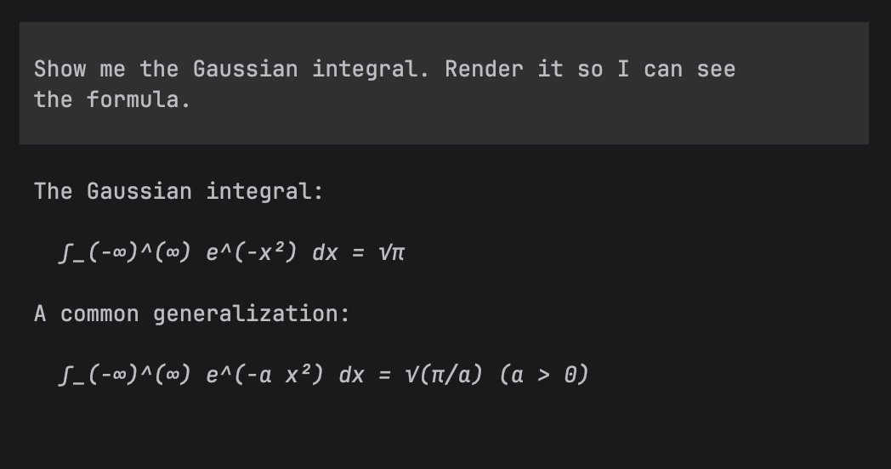

<div align="center">


# mathshow

**Show LaTeX math from any CLI agent.**

Agents already write `$...$`. Cursor, Claude Code, Codex — none of those TUIs typeset it. `mathshow` renders with [KaTeX](https://katex.org) and opens a browser preview. No agent wrapper.

<br />

```bash
npx skills add iCodeCraft/mathshow
```

<br />

[Cursor](https://cursor.com) · [Claude Code](https://docs.anthropic.com/en/docs/claude-code) · [Codex](https://openai.com/codex/) · [70+ agents](https://github.com/vercel-labs/skills#supported-agents) · [Agent Skills](https://agentskills.io) · [MIT](./LICENSE)

</div>

---

## Same ask. Actually readable math.

Same prompt. One session without the skill, one with:

> Show me the Gaussian integral. Render it so I can see the formula.

<p align="center">
  
  &nbsp;
  
</p>

<p align="center">
  <strong>Unicode in the TUI</strong>&nbsp;&nbsp;→&nbsp;&nbsp;<strong>KaTeX preview</strong>
</p>

Agents already “write” the math. Without `mathshow` you still squint at `∫_(-∞)^(∞)`. With it, the formula opens rendered.

---

## Install

Two pieces: the **skill** (when/how the agent should show math) and the **CLI** (KaTeX preview).

```bash
# 1. Skill — works with Cursor, Claude Code, Codex, and many more
npx skills add iCodeCraft/mathshow

# 2. CLI — agents call it via npx (no global install required)
npx --yes mathshow -- 'E = mc^2'
```

```bash
# pin an agent
npx skills add iCodeCraft/mathshow -a cursor -y
npx skills add iCodeCraft/mathshow -a claude-code -y

# every project on this machine
npx skills add iCodeCraft/mathshow -g -y

# optional: put mathshow on PATH
npm i -g mathshow
```

<details>
<summary>Where skills land</summary>

| Tool | Project | Global |
|------|---------|--------|
| Cursor | `.agents/skills/` | `~/.cursor/skills/` |
| Claude Code | `.claude/skills/` | `~/.claude/skills/` |
| Codex / others | `.agents/skills/` | under `~/` |

Portable via the [skills CLI](https://github.com/vercel-labs/skills) — no Cursor-only lock-in. Source of truth in this repo is [`skills/`](./skills/).

</details>

---

## Use

```bash
npx --yes mathshow -- 'E = mc^2'
npx --yes mathshow notes.md
echo '$$\int_{-\infty}^{\infty} e^{-x^2}\,dx$$' | npx --yes mathshow
```

| Flag / env | |
|---|---|
| `--no-open` | write preview HTML, don't open a browser |
| `--out <dir>` | preview directory (default: `$TMPDIR/mathshow-preview`) |
| `MATHSHOW_NO_OPEN=1` / `CI=true` | same as `--no-open` |

Raw TeX with no `$` is one display formula. Markdown is scanned for `$$...$$`, `$...$`, `\[...\]`, `\(...\)`.

### Skill: `show-math`

| | Skill | Does |
|:-:|:------|:-----|
| `/show-math` | [`show-math`](./skills/show-math/SKILL.md) | When the user should **see** a formula, run `mathshow` — real TeX in, KaTeX preview out. |

New session → skill loads when the task involves formulas, or type the command.

<details>
<summary>What the skill requires</summary>

- MUST run `mathshow` when the reply contains math the user needs to see
- MUST pass real TeX (`\int`, `\frac`, `\sum`), not Unicode approximations as the source
- NEVER skip the preview because the transcript already shows `$...$`
- NEVER use image-generation tools to draw equations

Full playbook: [`skills/show-math/SKILL.md`](./skills/show-math/SKILL.md).

</details>

Agents without skills — one line in `AGENTS.md`:

```
When the user should see a formula, run: npx --yes mathshow -- '<latex>'
```

---

## Why it exists

CLI agents write LaTeX. Users still see raw `$...$`. Wrapping the agent in a PTY cannot reliably pull math out of a full-screen TUI.

**mathshow is the portable contract:** if the agent can run a shell command, it can show math. Preview opens in the browser (KaTeX) — that path works for every agent and IDE.

---

## Develop

```bash
git clone https://github.com/iCodeCraft/mathshow.git
cd mathshow
npm install
npm test
npm run validate:skills

# local skill install for Cursor
npx skills add . -a cursor -y
```

**Contributing** · keep the skill focused · MUST/NEVER over essays · [`CONTRIBUTING.md`](./CONTRIBUTING.md)
